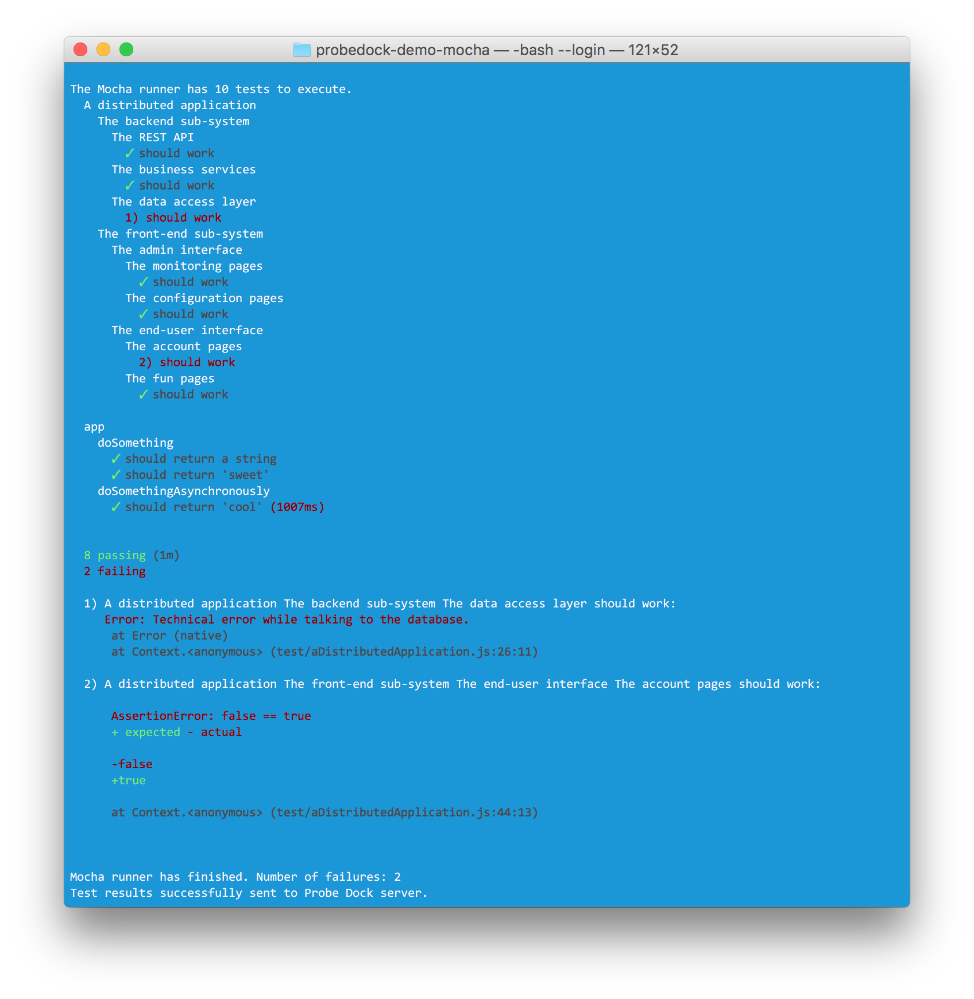
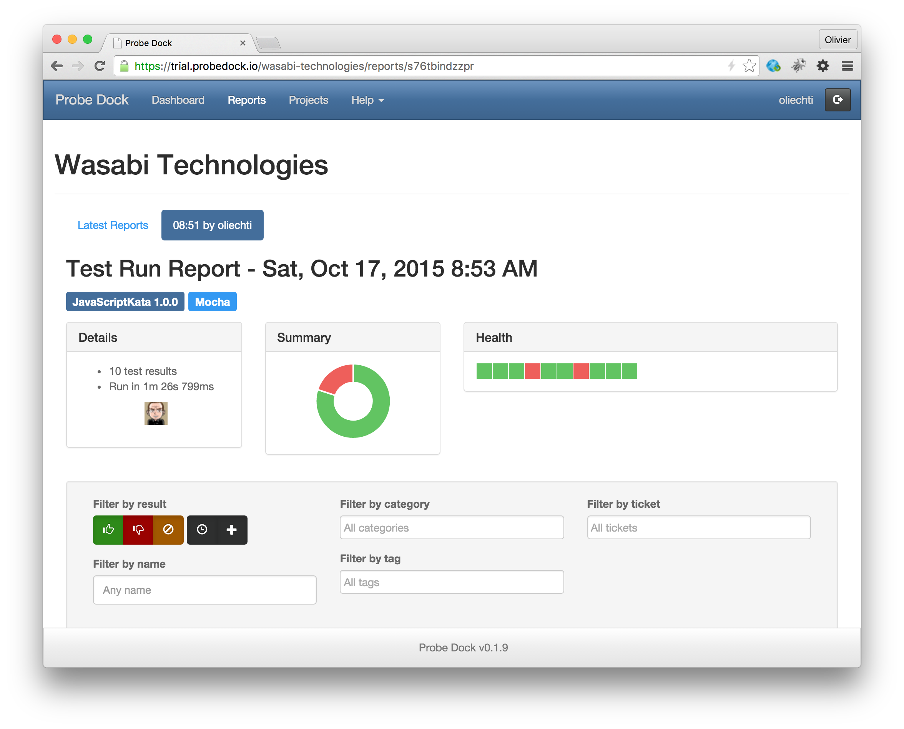
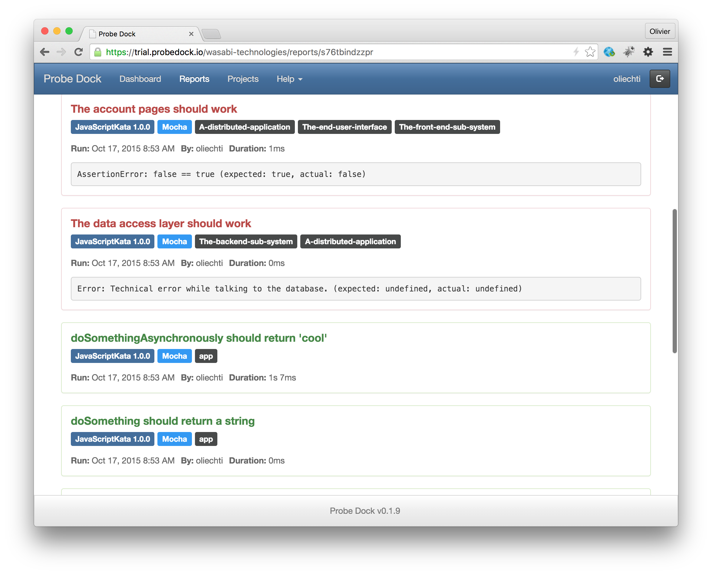
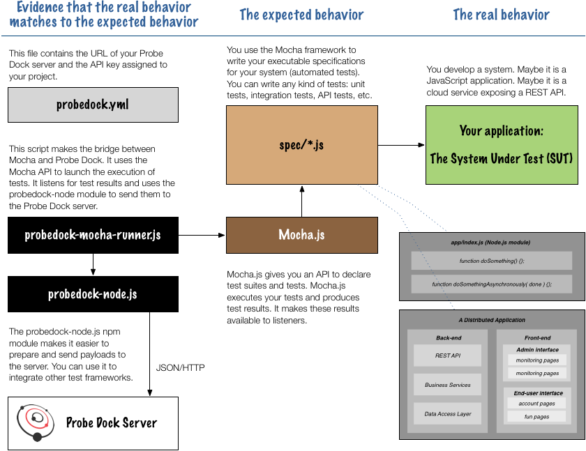

# probedock-demo-mocha

The code in this repo shows how to integrate Probe Dock with existing JavaScript test frameworks and **how to use our npm [probedock-node](https://www.npmjs.com/package/probedock-node) library**.

To illustrate the process, we have looked at the very popular [mocha](https://mochajs.org/) framework. 

We have used Mocha to create an **executable specification**, i.e. a collection of suites of automated tests. We have then written a script that launches the execution of the scripts by Mocha and that receives test results. The script then uses the Probe Dock node library to send the results to the Probe Dock server.

## TL;DR

If you want to see the tool in action, proceed as follows:

1. Make sure that you have **access to a Probe Dock server**. From it web interface, create a new project and grab its API key. If you don't have any Probe Dock server yet, visit [the trial server](https://trial.probedock.io) for a free account and have a look at [this](http://probedock.io/getting-started/) page. Follow the instructions and make sure that you create a file in your home directory (`~/.probedock/config.yml`), in which you provide your server credentials.

2. Edit the `probedock.yml` file and enter the URL of your Probe Dock server and the API key of your project.

3. Execute the following command (with 2 expected errors):

```
$ node probedock-mocha-runner.js 
```

You should get the following output on the console:



Finally, check the results on the Probe Dock server:





## Overview

An overview of the system is shown below. The diagram shows that:

* On the right side, you have **a system that you want to test**. Maybe it is a Node.js module, for which you would like to write unit tests. But maybe it is system implemented in another language, for which you would like to write API tests or UI-level tests. In this repo, we have an example for each of these scenarios. In any case, on the right side you have **something that has an actual behavior**.

* In the middle, you have an **executable specification**, which consists of a collection of test suites, which contains collections of automated tests. You use the **Mocha API** to write these test suites in Javascript files and later on the **Mocha runner** to later execute them (you can start the Mocha runner from the command line with the `mocha` executable, but this is not what we do in this configuration). In the middle, **you specify the expected behavior of your system**.

* On the left side, you have the components that **trigger the execution of the tests**, that **collect the results** and that **send them to the Probe Dock server** where the team can analyze them. The probedock-mocha-runner script uses the mocha npm module to programmatically control Mocha: it launches the mocha runner and listens for test result events. The probedock-mocha-runner script uses the probedock-node npm module. **In the end, you have a way to check if the actual behavior of your system corresponds to its intended behavior**.





## Implementation

### How do we execute tests with Mocha?

As mentioned earlier, there are different ways to launch Mocha. Some developers install the `mocha` executable from the command line and they see test results on the console. Other developers use a third-party plugin in their build system (grunt, gulp, etc.), so that tests are executed by the build pipeline. The authors of these plugins have used the API provided by Mocha, very much like we have done.

In our solution, you execute the tests by running the probedock-mocha-runner.js script, which we have implemented. The first thing that we do in this script is to import the mocha module, specify where our test files are located and launch a mocha runner. The following code is not exactly what you will find in the script, but it captures the essence of the previous operations:

```
var Mocha = require('mocha');
var mocha = new Mocha();

mocha.addFile("spec/index.js");

var mochaRunner = mocha.run(function(numberOfFailures) {
  ...
}
```

### How do we get test results from Mocha?

There are different ways to get test results produced by a mocha runner. The most common approach is to create a [custom](https://github.com/mochajs/mocha/wiki/Third-party-reporters) [reporter](https://mochajs.org/#reporters). However, the current version of Mocha only allows you to use a single reporter at the time. Since we wanted to keep using the standard console reporters, we have preferred to directly subscribe to the events published by the mocha runner. There are quite a few (do a search on "emit" in [this](https://github.com/mochajs/mocha/blob/master/lib/runner.js) file). The two interesting events are "pass" and "fail", which are emitted when a test has been executed. The following code give you an idea for what we do in our script:

```
mochaRunner.on('pass', function(test) {
  // the test parameter gives us access to plenty of 
  // information about the test specification
}).on('fail', function(test, err) {
  // the test and err parameters contain information
  // about the spec and why it is not satisfied
});
```

### How do I send test results to the Probe Dock server?

In order to send the test results to Probe Dock, the following operations must be performed:

1. Import the probedock-node module and get a reference to the **client** object.
2. **Load the configuration** (from the probedock.yml file), which contain the project key and the URL of the Probe Dock server.
3. Tell the client that **the test run has started**.
4. Ask Mocha to execute the tests and subscribe to its events.
5. For each passed and failed test, tell the probedock client to **add a result**.
6. When all tests have been run, tell probedock to **end the test run**.
7. Optionally **save** the probedock payload in a local file.
8. Tell the probedock client to **send the payload** to the server.

You can do this with code that follows this structure:

```
var probedock = require('probedock-node').client;
var config = probedock.loadConfig();
var probeDockTestRun = probedock.startTestRun(config);
probeDockTestRun.category = "Mocha";

var passed = true;
var failed = false;

// for each successful test:
probeDockTestRun.add(null, "the function f should work", passed, test.duration, {
	tags: ["demo", "fun", "javascript"]
});

// for each failed test:
probeDockTestRun.add(null, "the function g should work", failed, test.duration, {
    message: err.name + ": " + err.message,
	tags: ["demo", "fun", "javascript"]
});

probeDockTestRun.end();

// the following step is optional but helpful to debug the runner
probedock.saveTestRun("./test-run-dump.json", probeDockTestRun, config);

probedock.process(probeDockTestRun, config).then(function(logInfo, startTime) {
	console.log("Test results successfully sent to Probe Dock server.");
});

```

## Contributing

* [Fork](https://help.github.com/articles/fork-a-repo)
* Create a topic branch - `git checkout -b my_feature`
* Push to your branch - `git push origin my_feature`
* Create a [pull request](http://help.github.com/pull-requests/) from your branch

Please add a [changelog](CHANGELOG.md) entry with your name for new features and bug fixes.

## License

This sofotware is licensed under the [MIT License](http://opensource.org/licenses/MIT).
See [LICENSE.txt](LICENSE.txt) for the full license.

